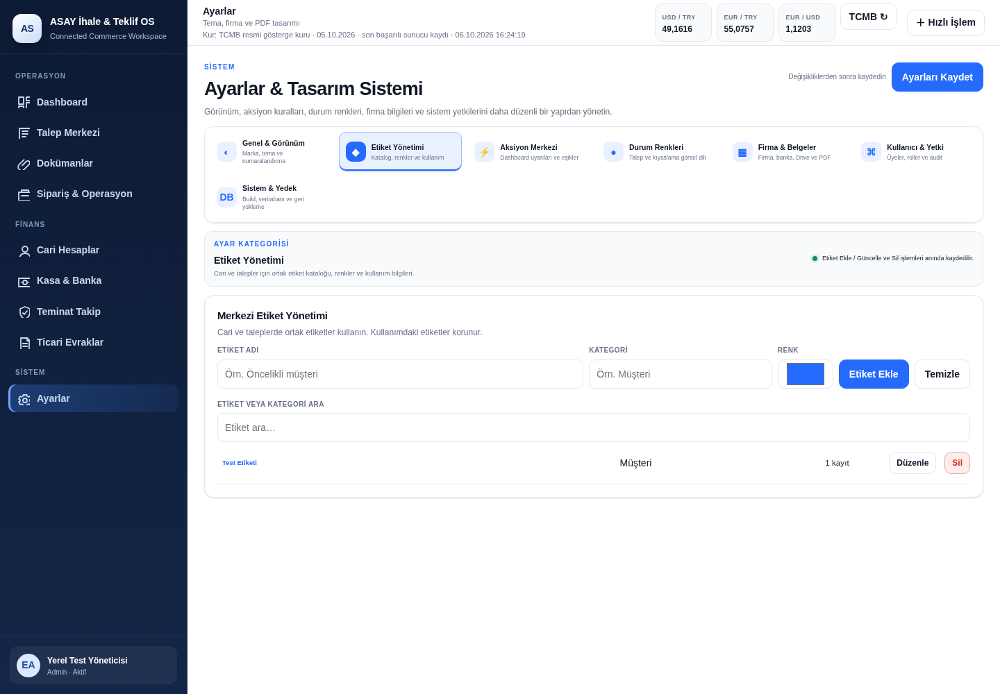

# ASAY İhale & Teklif OS

PHP + MySQL/MariaDB uygulaması. Bu depo, yüklenen ASAY arşivindeki kaynak kodunu ve V3.13.4-P1 düzeltmelerini içerir.

## Gereksinimler ve çalıştırma

PHP 8.4, PDO MySQL, mbstring, XML ve ZIP uzantıları ile MySQL/MariaDB gereklidir. PHP 8.4 / MariaDB 11.8 üzerinde test edilmiştir.

1. `config/drive.example.php` dosyasını `config/drive.php` olarak kopyalayın. Google Drive kullanmayacaksanız boş varsayılan ayarları bırakabilirsiniz.
2. MySQL/MariaDB sunucusunu çalıştırın. Uygulama ayarlarını kurulum ekranında belirtin; yerel ayarlar `config/database.local.php` dosyasına kaydedilir.
3. Depo kökünde `php -S 127.0.0.1:8080` komutunu çalıştırın.
4. Tarayıcıda yerel `install.php` ekranını açın. Yeni ve boş bir geliştirme veritabanı kullanın; mevcut üretim verisini sıfırlamayın.
5. Oluşturduğunuz yönetici hesabıyla giriş yapın.

Veritabanı bağlantı bilgileri, Google Drive OAuth ayarları, müşteri evrakları ve veri yedekleri Git'e eklenmez. `storage` klasörünü uygulama kullanıcısının yazabileceği şekilde oluşturun; `.htaccess` korunmalıdır. Üretim dağıtımında PHP'nin geliştirme sunucusu yerine PHP destekli bir web sunucusu kullanın. Apache dışındaki sunucularda `storage` ve `config` dizinlerine HTTP erişimini ayrıca engelleyin.

## Canlı ön izleme

GitHub kaynak kodunu barındırır. GitHub Pages PHP ve MySQL çalıştırmadığı için bu uygulamanın canlı ön izlemesini tek başına sunamaz. Canlı uygulama için PHP + MySQL/MariaDB destekleyen bir sunucuya dağıtım ve veritabanı bağlantısı gerekir. Bu depo henüz bir canlı dağıtım servisine bağlı değildir.

## Düzeltmeler ve doğrulama

[Düzeltmeler, bulunan hatalar ve kalan kontroller](docs/INCELEME_V3_13_4_P1.md)

```sh
python tests/static_check.py
python tests/pdf_parity_check.py
php tests/state_hash_roundtrip.php
ASAY_E2E_DB=1 php tests/e2e_db_contract.php
```

[İzole veritabanında tarayıcı testleri](tests/BROWSER_VALIDATION.md). Tarayıcı fixture testleri iş verisini değiştirir; üretim veritabanında çalıştırmayın.

## Test ortamından ekran görüntüleri

Bu görüntüler örnek verilerle çalışan uygulamadan alınmıştır; canlı site bağlantısı değildir.



[PDF stüdyosu](docs/screenshots/pdf-studyosu.png) · [Ödeme takibi](docs/screenshots/odeme-takibi.png) · [Mobil ayarlar](docs/screenshots/ayarlar-mobil.png)
